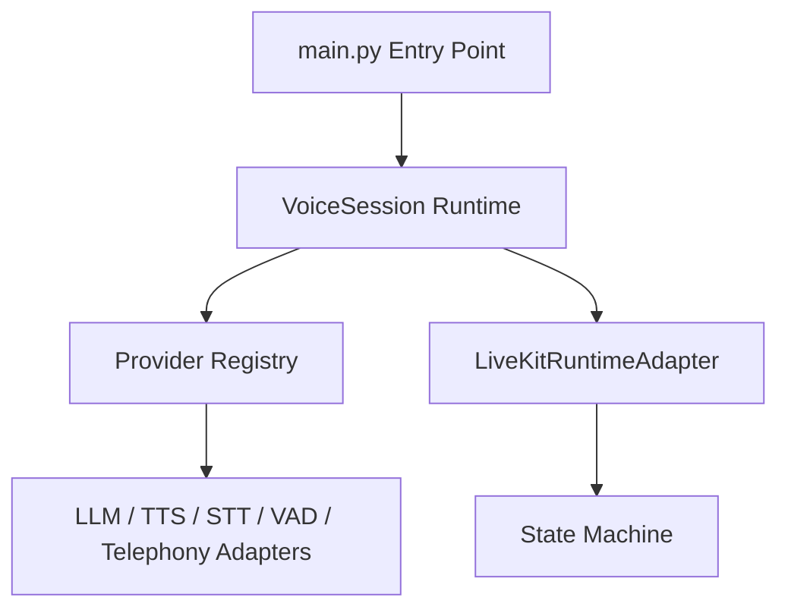

# DANA AI Platform Clean Architecture

This document describes the clean, production-ready, modular architecture of the Dana outbound AI voice platform.

## Architectural Goals
* **Modularity**: Complete separation between the WebRTC/telephony layer, state machine, and provider adapters.
* **Stability**: Strict failure isolation on live calls.
* **Low Latency**: Performance-optimized data path with zero unnecessary allocations.
* **Cost Efficiency**: Dynamic, rules-based provider selection depending on target modes (e.g. cheapest safe, balanced, locked).

## Core Architecture Layers

### 1. Unified Entry Point (`main.py`)
Delegates all participant session initialization and lifecycle hooks directly to `VoiceSession`. Initializes process-level `SharedComponents` once on process prewarm to load heavyweight neural models into memory.

### 2. Runtime Session Coordinator (`dana/runtime/voice_session.py`)
* Coordinates the WebRTC audio channels, VAD detection events, and STT transcripts.
* Drives the conversational turn cycle using a single production event-loop.
* Tracks real-time costs and outputs standardized log markers.

### 3. Provider Registry & Routing Engine (`dana/providers/`)
* **Provider Registry**: Service registry containing all available STT, TTS, LLM, VAD, and Telephony adapters.
* **Routing Engine**: Evaluates provider stacks based on the campaign requirements and environment availability.
  * `locked` mode: Strictly uses the configured providers; fails if unhealthy.
  * `balanced` mode: Prefers premium cloud APIs (Deepgram, ElevenLabs) if healthy, fallback to local models if cloud keys are missing/invalid.

### 4. LiveKit Runtime Adapter (`core/livekit_runtime_adapter.py`)
Separates WebRTC networking logic from the conversational state machine. Evaluates compliance rules, objection classifications, prompt loading, output validation, and CRM integration outbox pushes.
