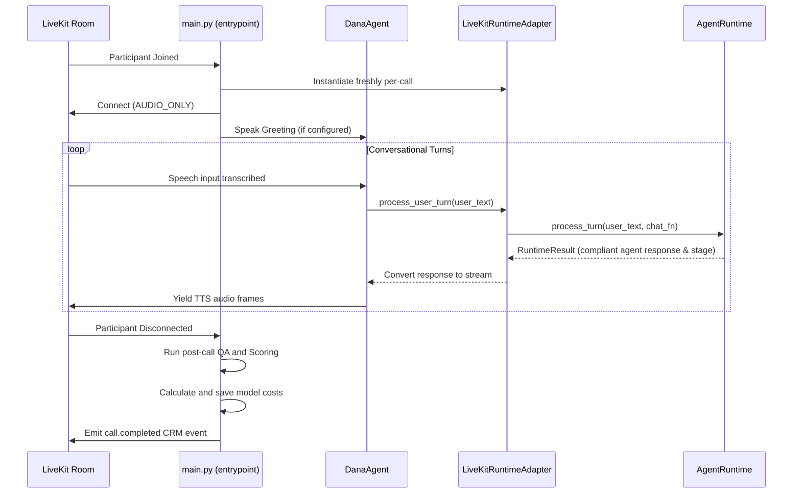

# Dana Voice Agent Runtime Map & Architecture Audit

> [!IMPORTANT]
> **CRITICAL CRITERIA — WHAT MUST NEVER BREAK:**
> 1. **Do Not Call (DNC) Requests & Stop Policy:** Any request to stop, remove, or DNC must immediately trigger the stop policy and mark the lead as DNC. Under no circumstances should the agent continue talking or fail to register the DNC request in the database.
> 2. **Wrong Number Handling:** If the prospect reports a wrong number, the conversation must transition to the `END` stage immediately and terminate without further sales pitch or turn attempts.
> 3. **Explicit Transfer Consent:** Transfer to a licensed agent must *only* occur with explicit, affirmative consent from the prospect. Silence, ambiguity, or negative responses must never result in a transfer trigger.
> 4. **Compliance Guardrails:** Compliance rules are strictly enforced. The agent must never quote premiums/prices, claim government affiliation, promise or guarantee approval, say "you qualify," or claim to be a licensed agent.
> 5. **Per-Call State Isolation:** Mutable objects like [LeadProfile](file:///C:/Users/jimbo/.gemini/antigravity/worktrees/ultimate-voice/audit-dana-runtime-architecture/core/lead_profile.py#L14) and [StateMachine](file:///C:/Users/jimbo/.gemini/antigravity/worktrees/ultimate-voice/audit-dana-runtime-architecture/core/state_machine.py#L28) must be instantiated freshly per-call to prevent memory leaks or cross-talk state contamination.

---

## 1. Main Entrypoint and LiveKit Session Flow
- **File Path:** [main.py](file:///C:/Users/jimbo/.gemini/antigravity/worktrees/ultimate-voice/audit-dana-runtime-architecture/main.py)
- **Class / Function Names:**
  - `[prewarm](file:///C:/Users/jimbo/.gemini/antigravity/worktrees/ultimate-voice/audit-dana-runtime-architecture/main.py#L894)`: Executed when the worker process starts, pre-loading Silero VAD, local/cloud LLMs, and local TTS models into GPU memory.
  - `[entrypoint](file:///C:/Users/jimbo/.gemini/antigravity/worktrees/ultimate-voice/audit-dana-runtime-architecture/main.py#L441)`: The core LiveKit session orchestrator. It sets up VAD-based turn detection, configures interruption and preemptive generation, subscribes to room audio, instantiates [LiveKitRuntimeAdapter](file:///C:/Users/jimbo/.gemini/antigravity/worktrees/ultimate-voice/audit-dana-runtime-architecture/core/livekit_runtime_adapter.py#L27), and runs the audio loop.
  - `[DanaAgent](file:///C:/Users/jimbo/.gemini/antigravity/worktrees/ultimate-voice/audit-dana-runtime-architecture/main.py#L229)`: A subclass of the LiveKit `Agent` that overrides `llm_node` and `tts_node` to connect LiveKit inputs/outputs to our internal, deterministic pipeline.

### Session Lifecycle Flow


---

## 2. How Dana Loads Prompts
- **File Paths:**
  - [main.py](file:///C:/Users/jimbo/.gemini/antigravity/worktrees/ultimate-voice/audit-dana-runtime-architecture/main.py)
  - [core/prompt_loader.py](file:///C:/Users/jimbo/.gemini/antigravity/worktrees/ultimate-voice/audit-dana-runtime-architecture/core/prompt_loader.py)
  - [core/response_builder.py](file:///C:/Users/jimbo/.gemini/antigravity/worktrees/ultimate-voice/audit-dana-runtime-architecture/core/response_builder.py)
- **Class / Function Names:**
  - `[load_instructions](file:///C:/Users/jimbo/.gemini/antigravity/worktrees/ultimate-voice/audit-dana-runtime-architecture/main.py#L78)`: Reads the initial static prompt from the path in `DANA_AGENT_PROMPT_PATH` (defaults to `prompts/final_expense_alex.md`), falling back to `_DEFAULT_INSTRUCTIONS` if unreadable.
  - `[PromptLoader](file:///C:/Users/jimbo/.gemini/antigravity/worktrees/ultimate-voice/audit-dana-runtime-architecture/core/prompt_loader.py#L47)`: Handles loading and LRU-caching of prompt components (`final_expense_agent.md`, `voice_style_rules.md`, `compliance_guardrails.md`) and YAML configuration files.
  - `[ResponseBuilder.build_instructions](file:///C:/Users/jimbo/.gemini/antigravity/worktrees/ultimate-voice/audit-dana-runtime-architecture/core/response_builder.py#L20)`: Composes the dynamic system instructions for each LLM turn. It compiles the current conversation state metrics, collected lead profile data fields, stage-specific response guidance, objection handling directives, and RAG context into a composite markdown instruction block injected directly into the LLM system prompt.

---

## 3. Current Call-Stage State Machine
- **File Paths:**
  - [core/state_machine.py](file:///C:/Users/jimbo/.gemini/antigravity/worktrees/ultimate-voice/audit-dana-runtime-architecture/core/state_machine.py)
  - [core/call_state.py](file:///C:/Users/jimbo/.gemini/antigravity/worktrees/ultimate-voice/audit-dana-runtime-architecture/core/call_state.py)
  - [states/](file:///C:/Users/jimbo/.gemini/antigravity/worktrees/ultimate-voice/audit-dana-runtime-architecture/states/) (all files in folder)
- **Class / Function Names:**
  - `[CallStage](file:///C:/Users/jimbo/.gemini/antigravity/worktrees/ultimate-voice/audit-dana-runtime-architecture/core/call_state.py#L17)`: Enum representing all possible stages.
  - `[CallState](file:///C:/Users/jimbo/.gemini/antigravity/worktrees/ultimate-voice/audit-dana-runtime-architecture/core/call_state.py#L35)`: Mutable tracking dataclass holding current stage, previous stage, turn/objection counters, and timestamps.
  - `[StateMachine](file:///C:/Users/jimbo/.gemini/antigravity/worktrees/ultimate-voice/audit-dana-runtime-architecture/core/state_machine.py#L28)`: Orchestrates transitions between stages using the pre-defined happy path list.
  - `[BaseState](file:///C:/Users/jimbo/.gemini/antigravity/worktrees/ultimate-voice/audit-dana-runtime-architecture/states/base.py#L11)`: Abstract class implemented by all stage-specific handlers (e.g. [OpeningState](file:///C:/Users/jimbo/.gemini/antigravity/worktrees/ultimate-voice/audit-dana-runtime-architecture/states/opening.py#L11), [InterestCheckState](file:///C:/Users/jimbo/.gemini/antigravity/worktrees/ultimate-voice/audit-dana-runtime-architecture/states/interest_check.py#L11), [TransferConsentState](file:///C:/Users/jimbo/.gemini/antigravity/worktrees/ultimate-voice/audit-dana-runtime-architecture/states/transfer_consent.py#L11)).

### Call-Stage Transitions (Happy Path)
```
[OPENING]
    │
    ▼
[INTEREST_CHECK] (open_to_review)
    │
    ▼
[AGE_RANGE] (age_range_confirmed: 40-85)
    │
    ▼
[LIVING_SITUATION] (living_independently)
    │
    ▼
[DECISION_MAKER] (financial_decision_maker)
    │
    ▼
[TRANSFER_CONSENT] (transfer_consent_confirmed)
    │
    ▼
[TRANSFER_READY] (Trigger feTransfer Tool)
```
*Note: Any stop keywords or explicit refusal triggers transition the flow immediately to terminal stages: [CALLBACK](file:///C:/Users/jimbo/.gemini/antigravity/worktrees/ultimate-voice/audit-dana-runtime-architecture/states/callback.py#L11), [DNC](file:///C:/Users/jimbo/.gemini/antigravity/worktrees/ultimate-voice/audit-dana-runtime-architecture/states/dnc.py#L11), [DISQUALIFIED](file:///C:/Users/jimbo/.gemini/antigravity/worktrees/ultimate-voice/audit-dana-runtime-architecture/states/disqualified.py#L11), or [END](file:///C:/Users/jimbo/.gemini/antigravity/worktrees/ultimate-voice/audit-dana-runtime-architecture/core/call_state.py#L31).*

---

## 4. How the AgentRuntime Processes Each User Turn
- **File Path:** [core/agent_runtime.py](file:///C:/Users/jimbo/.gemini/antigravity/worktrees/ultimate-voice/audit-dana-runtime-architecture/core/agent_runtime.py)
- **Class / Function Names:**
  - `[AgentRuntime.process_turn](file:///C:/Users/jimbo/.gemini/antigravity/worktrees/ultimate-voice/audit-dana-runtime-architecture/core/agent_runtime.py#L152)`: Orchestrates the pipeline for a single turn.

### Pipeline Stage Execution Order
1. **Increment Turn:** Updates the conversational turn counter in the call state.
2. **Publish Utterance & Store:** Saves the raw user utterance to the DB via the repository and publishes a `UtteranceReceivedEvent`.
3. **Stop Policy Check:** Evaluates [CallStopPolicy](file:///C:/Users/jimbo/.gemini/antigravity/worktrees/ultimate-voice/audit-dana-runtime-architecture/safety/call_stop_policy.py#L15) for DNC, wrong numbers, or immediate hangup requests. If triggered, transitions, logs details, and halts further execution.
4. **Topic Redirect Check:** Evaluates `TopicRedirectPolicy` to detect divergent topics (politics, weather, sports, personal questions, jokes, AI/bot, or irrelevant topics). If detected, short-circuits the turn immediately with a compliant, one-sentence redirect response, avoiding LLM generation and RAG retrieval.
5. **Objection Classification:** Detects objection intents and increments counts.
6. **State Handler Execution:** Invokes the active stage's `handle()` method to extract data and resolve the target stage.
7. **RAG Context Retrieval:** Builds a query (user text + stage + objection) and retrieves relevant context.
8. **Instruction Assembly:** Generates prompt instructions via [ResponseBuilder](file:///C:/Users/jimbo/.gemini/antigravity/worktrees/ultimate-voice/audit-dana-runtime-architecture/core/response_builder.py#L17).
9. **LLM Generation:** Calls the `chat_fn` wrapper to run LLM completion on the assembled prompt.
10. **PII Redaction:** Scrubs potential sensitive info from the response using [PIIRedactor](file:///C:/Users/jimbo/.gemini/antigravity/worktrees/ultimate-voice/audit-dana-runtime-architecture/safety/pii_redaction.py#L13).
11. **Formatting & Compliance Check:** Runs validations. If failed, overrides the output with a pre-approved compliant response (e.g. [LICENSED_RESPONSE](file:///C:/Users/jimbo/.gemini/antigravity/worktrees/ultimate-voice/audit-dana-runtime-architecture/core/canonical_responses.py#L15)).
12. **Human-likeness Tuning:** Applies backchannel insertion, cleans "Perfect" usage, adjusts dialogue brevity/style, enforces repetition guards, and applies prosody TTS formatting.
13. **Spoken Audit:** Conducts a final check on the finalized string using [SpokenOutputAuditor](file:///C:/Users/jimbo/.gemini/antigravity/worktrees/ultimate-voice/audit-dana-runtime-architecture/voice/spoken_output_auditor.py#L15).
14. **Action Policy & Tools:** Checks recommended actions (e.g. scheduling a callback, initiating transfer) and executes their associated tools.
15. **Final Log and Transition Emit:** Saves the final agent response, updates the lead snapshot, and triggers CRM webhooks.

---

## 5. Where Objection Classification Happens
- **File Paths:**
  - [core/objection_classifier.py](file:///C:/Users/jimbo/.gemini/antigravity/worktrees/ultimate-voice/audit-dana-runtime-architecture/core/objection_classifier.py)
  - [core/objection_response_policy.py](file:///C:/Users/jimbo/.gemini/antigravity/worktrees/ultimate-voice/audit-dana-runtime-architecture/core/objection_response_policy.py)
  - [kb/objections/final_expense_objections.yaml](file:///C:/Users/jimbo/.gemini/antigravity/worktrees/ultimate-voice/audit-dana-runtime-architecture/kb/objections/final_expense_objections.yaml)
- **Class / Function Names:**
  - `[ObjectionClassifier](file:///C:/Users/jimbo/.gemini/antigravity/worktrees/ultimate-voice/audit-dana-runtime-architecture/core/objection_classifier.py#L31)`: Loads keywords from `final_expense_objections.yaml`, performs regex checks on the user utterance, computes a similarity/coverage confidence score, and returns the classified objection intent if it exceeds the threshold (default `0.3`).
  - `[ObjectionResponsePolicy](file:///C:/Users/jimbo/.gemini/antigravity/worktrees/ultimate-voice/audit-dana-runtime-architecture/core/objection_response_policy.py#L48)`: Tracks retry/rebuttal attempt counts per objection type. It resolves target stage changes and injects allowed response guidelines or terminates the call if the maximum attempt limit is hit.

---

## 6. Where RAG Context is Built
- **File Paths:**
  - [rag/context_builder.py](file:///C:/Users/jimbo/.gemini/antigravity/worktrees/ultimate-voice/audit-dana-runtime-architecture/rag/context_builder.py)
  - [rag/retriever.py](file:///C:/Users/jimbo/.gemini/antigravity/worktrees/ultimate-voice/audit-dana-runtime-architecture/rag/retriever.py)
  - [rag/vector_store.py](file:///C:/Users/jimbo/.gemini/antigravity/worktrees/ultimate-voice/audit-dana-runtime-architecture/rag/vector_store.py)
- **Class / Function Names:**
  - `[ContextBuilder.build_context](file:///C:/Users/jimbo/.gemini/antigravity/worktrees/ultimate-voice/audit-dana-runtime-architecture/rag/context_builder.py#L76)`: Formulates an enhanced query combining the user text, call stage, and objection type. It retrieves candidate documents, prioritizes categories, formats, and truncates to fit within the `4800` character limit.
  - `[Retriever.retrieve](file:///C:/Users/jimbo/.gemini/antigravity/worktrees/ultimate-voice/audit-dana-runtime-architecture/rag/retriever.py#L43)`: Performs vector search over the store and scores matching documents using cosine similarity. It applies boosts for compliance (`1.5`), scripts (`1.3`), and matching call stages (`1.4`).
  - `[get_vector_store](file:///C:/Users/jimbo/.gemini/antigravity/worktrees/ultimate-voice/audit-dana-runtime-architecture/rag/vector_store.py#L296)`: Factory function returning [PostgresVectorStore](file:///C:/Users/jimbo/.gemini/antigravity/worktrees/ultimate-voice/audit-dana-runtime-architecture/rag/vector_store.py#L149) if `DATABASE_URL` is set, otherwise falling back to the local file-based [JsonlVectorStore](file:///C:/Users/jimbo/.gemini/antigravity/worktrees/ultimate-voice/audit-dana-runtime-architecture/rag/vector_store.py#L45) pointing to `data/vector_index.jsonl`.

---

## 7. Where Compliance and Output Validation Happen
- **File Paths:**
  - [safety/compliance_filter.py](file:///C:/Users/jimbo/.gemini/antigravity/worktrees/ultimate-voice/audit-dana-runtime-architecture/safety/compliance_filter.py)
  - [safety/output_validator.py](file:///C:/Users/jimbo/.gemini/antigravity/worktrees/ultimate-voice/audit-dana-runtime-architecture/safety/output_validator.py)
- **Class / Function Names:**
  - `[ComplianceFilter.check](file:///C:/Users/jimbo/.gemini/antigravity/worktrees/ultimate-voice/audit-dana-runtime-architecture/safety/compliance_filter.py#L136)`: Scans the agent's proposed response against compiled regex forbidden patterns (approval claims, premium quotes, government programs/benefits, licensing claims, policy recommendations, coverage advice, urgency language, and medical underwriting claims).
  - `[OutputValidator.validate](file:///C:/Users/jimbo/.gemini/antigravity/worktrees/ultimate-voice/audit-dana-runtime-architecture/safety/output_validator.py#L73)`: Validates formatting constraints suitable for spoken delivery. It flags markdown syntax, list formats, chatbot-like phrases, multi-question sentences, and checks word counts (soft warning if > 60).

---

## 8. Where Spoken-Output Auditing Happens
- **File Path:** [voice/spoken_output_auditor.py](file:///C:/Users/jimbo/.gemini/antigravity/worktrees/ultimate-voice/audit-dana-runtime-architecture/voice/spoken_output_auditor.py)
- **Class / Function Names:**
  - `[SpokenOutputAuditor.audit](file:///C:/Users/jimbo/.gemini/antigravity/worktrees/ultimate-voice/audit-dana-runtime-architecture/voice/spoken_output_auditor.py#L18)`: The final gatekeeper for TTS delivery. It asserts strict rules on the final speech string, detecting bullet points, markdown symbols, corporate/AI disclosures, licensing claims, "you qualify" promises, dollar values, approval claims, sensitive information requests (SSN, credit card, bank info), and stage-specific brevity limits (e.g. `opening` stage is limited to 30 words).
  - If a violation is flagged, the runtime intercepts the text and replaces it with a safe fallback response resolved by `[AgentRuntime._get_stage_fallback](file:///C:/Users/jimbo/.gemini/antigravity/worktrees/ultimate-voice/audit-dana-runtime-architecture/core/agent_runtime.py#L635)`.

---

## 9. Where Call Turns are Saved
- **File Paths:**
  - [storage/repository.py](file:///C:/Users/jimbo/.gemini/antigravity/worktrees/ultimate-voice/audit-dana-runtime-architecture/storage/repository.py)
  - [storage/postgres_store.py](file:///C:/Users/jimbo/.gemini/antigravity/worktrees/ultimate-voice/audit-dana-runtime-architecture/storage/postgres_store.py)
  - [storage/jsonl_store.py](file:///C:/Users/jimbo/.gemini/antigravity/worktrees/ultimate-voice/audit-dana-runtime-architecture/storage/jsonl_store.py)
  - [storage/write_behind.py](file:///C:/Users/jimbo/.gemini/antigravity/worktrees/ultimate-voice/audit-dana-runtime-architecture/storage/write_behind.py)
- **Class / Function Names:**
  - `[Repository.save_call_turn](file:///C:/Users/jimbo/.gemini/antigravity/worktrees/ultimate-voice/audit-dana-runtime-architecture/storage/repository.py#L153)`: Persists the turn data using the Pydantic [CallTurn](file:///C:/Users/jimbo/.gemini/antigravity/worktrees/ultimate-voice/audit-dana-runtime-architecture/storage/schemas.py#L46) schema.
  - If [WriteBehindQueue](file:///C:/Users/jimbo/.gemini/antigravity/worktrees/ultimate-voice/audit-dana-runtime-architecture/storage/write_behind.py#L22) is enabled, the turn is enqueued to prevent blocking write latency. Otherwise, it writes directly to Postgres (`call_turns` table) or local JSONL (`data/call_turns.jsonl` file).

---

## 10. Where QA Scoring Happens
- **File Paths:**
  - [main.py](file:///C:/Users/jimbo/.gemini/antigravity/worktrees/ultimate-voice/audit-dana-runtime-architecture/main.py)
  - [qa/scoring.py](file:///C:/Users/jimbo/.gemini/antigravity/worktrees/ultimate-voice/audit-dana-runtime-architecture/qa/scoring.py)
  - [qa/rubric.py](file:///C:/Users/jimbo/.gemini/antigravity/worktrees/ultimate-voice/audit-dana-runtime-architecture/qa/rubric.py)
- **Class / Function Names:**
  - `[CallScorer.score_call](file:///C:/Users/jimbo/.gemini/antigravity/worktrees/ultimate-voice/audit-dana-runtime-architecture/qa/scoring.py#L327)`: Evaluates a completed call record across 11 rubric metrics (opening strength, realism, short flow completion, objection handling, compliance safety, transfer readiness, DNC handling, disqualification confirmation, talk/listen balance, latency, close probability).
  - `[detect_hard_failures](file:///C:/Users/jimbo/.gemini/antigravity/worktrees/ultimate-voice/audit-dana-runtime-architecture/qa/scoring.py#L128)`: Performs static checks for 12 critical errors. Any detected hard failure overrides the overall score to `0.0` and assigns a letter grade of `"F"`.
  - At session completion in `main.py` (lines 694–775), the scorer is run, the scorecard report is saved to `qa_reports`, and if the score is < 7.0 or grade is F, a `qa.failed` event is emitted.

---

## 11. Where Transfer, Callback, and DNC Tools Execute
- **File Paths:**
  - [tools/fe_transfer.py](file:///C:/Users/jimbo/.gemini/antigravity/worktrees/ultimate-voice/audit-dana-runtime-architecture/tools/fe_transfer.py)
  - [telephony/fe_transfer.py](file:///C:/Users/jimbo/.gemini/antigravity/worktrees/ultimate-voice/audit-dana-runtime-architecture/telephony/fe_transfer.py)
  - [tools/schedule_callback.py](file:///C:/Users/jimbo/.gemini/antigravity/worktrees/ultimate-voice/audit-dana-runtime-architecture/tools/schedule_callback.py)
  - [tools/mark_dnc.py](file:///C:/Users/jimbo/.gemini/antigravity/worktrees/ultimate-voice/audit-dana-runtime-architecture/tools/mark_dnc.py)
- **Class / Function Names:**
  - `[FeTransferTool.execute](file:///C:/Users/jimbo/.gemini/antigravity/worktrees/ultimate-voice/audit-dana-runtime-architecture/tools/fe_transfer.py#L33)`: Instantiates the outbound transfer workflow via `fe_transfer()` in [telephony/fe_transfer.py](file:///C:/Users/jimbo/.gemini/antigravity/worktrees/ultimate-voice/audit-dana-runtime-architecture/telephony/fe_transfer.py#L55). This invokes the [TransferRouter](file:///C:/Users/jimbo/.gemini/antigravity/worktrees/ultimate-voice/audit-dana-runtime-architecture/telephony/transfer_router.py#L12) to select a warm bridge or cold transfer, muting/closing the session upon success or falling back to a callback schedule upon failure.
  - `[ScheduleCallbackTool.execute](file:///C:/Users/jimbo/.gemini/antigravity/worktrees/ultimate-voice/audit-dana-runtime-architecture/tools/schedule_callback.py#L31)`: Enters a pending callback slot in the database and updates lead details.
  - `[MarkDncTool.execute](file:///C:/Users/jimbo/.gemini/antigravity/worktrees/ultimate-voice/audit-dana-runtime-architecture/tools/mark_dnc.py#L30)`: Registers the phone number in the DNC collection/table to ensure it is excluded from outbound campaigns.

---

## 12. Best Safe Extension Points for a Continuous Training System

To implement a continuous training loop without breaking live-call runtimes, violating compliance, or auto-approving training data, use the following design guidelines:

### A. Post-Call Hook Hook (Main Loop)
- **Extension Point:** Inside the `finally` block of `[entrypoint](file:///C:/Users/jimbo/.gemini/antigravity/worktrees/ultimate-voice/audit-dana-runtime-architecture/main.py#L441)` in [main.py](file:///C:/Users/jimbo/.gemini/antigravity/worktrees/ultimate-voice/audit-dana-runtime-architecture/main.py).
- **How it works:** Once the call session concludes, the turns and scorer results are fully populated. We can enqueue the `CallRecord` and its corresponding `QAScorecard` to a training pipeline queue.
- **Safety:** Because this runs *after* the connection is closed, it is completely decoupled from call latency and cannot cause live call drops.

### B. Training Notes Ingestion Filter
- **Extension Point:** Enhancing `[TrainingLessonExtractor](file:///C:/Users/jimbo/.gemini/antigravity/worktrees/ultimate-voice/audit-dana-runtime-architecture/training/extract_training_lessons.py#L197)` in [training/extract_training_lessons.py](file:///C:/Users/jimbo/.gemini/antigravity/worktrees/ultimate-voice/audit-dana-runtime-architecture/training/extract_training_lessons.py).
- **How it works:** Auto-generated lessons from high-performing transcripts must be saved with the attribute `use_in_live_call=False` by default in the [TrainingNote](file:///C:/Users/jimbo/.gemini/antigravity/worktrees/ultimate-voice/audit-dana-runtime-architecture/training/training_note_schema.py#L12) schema.
- **Safety:** This enforces the compliance constraint: *no auto-approvals*. An operator must review the generated lesson in an admin interface, toggle `use_in_live_call=True`, and trigger the RAG re-indexing.

### C. Vector Store Re-indexing Hook
- **Extension Point:** The `[BaseVectorStore.build_index](file:///C:/Users/jimbo/.gemini/antigravity/worktrees/ultimate-voice/audit-dana-runtime-architecture/rag/vector_store.py#L35)` method in [rag/vector_store.py](file:///C:/Users/jimbo/.gemini/antigravity/worktrees/ultimate-voice/audit-dana-runtime-architecture/rag/vector_store.py).
- **How it works:** A scheduled background job should query all approved training notes (where `use_in_live_call` is `True`) from the database, recompute embeddings, and rebuild the vector store index.
- **Safety:** By batching updates asynchronously, we prevent database contention during active calling periods.
