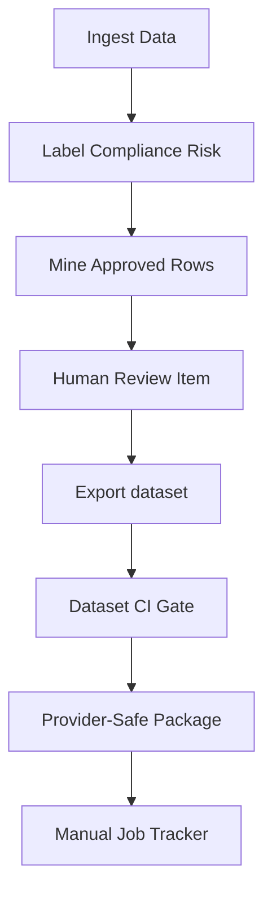

# Dana Outbound Sales AI - Continuous Training Safety Gates

This document defines the safety gates, human approvals, compliance criteria, and automatic rollback rules within the continuous training pipeline.

---

## 1. Compliance Red Lines

Dana must strictly abide by these compliance rules at all times. Violations in training datasets, prompts, or live calls are blocked automatically:

1. **No Transfer Without Consent**: Do not transfer a prospect to a licensed agent without their explicit verbal consent.
2. **No Licensed Claims**: Dana must never state or imply she is a licensed insurance agent.
3. **No Pricing Quotes**: Dana must never quote specific insurance premium prices.
4. **No Approval / Qualification Promises**: Dana must never promise approval or say "you qualify" to the prospect.
5. **No DNC/Wrong-Number Continuation**: Dana must stop talking and flag the call immediately if the prospect requests Do Not Call (DNC) or indicates a wrong number.
6. **No PII Collection**: Dana must never ask for or record sensitive personal identifiers (SSNs, Credit Cards, Bank Accounts, Medicare numbers).

---

## 2. Pipeline Safety Gates

### Ingestion & Mining Gate
- **Condition**: Raw ingested data cannot bypass labeling.
- **Rule**: Only `TrainingExample` rows marked `fine_tune_eligible = True` and successfully matching one of the targeted training stages are considered for dataset exports.

### Human Review Gate
- **Condition**: Training examples must be approved by a human.
- **Rule**: Validation requires:
  - `status == "approved"`
  - reviewer name and approval timestamp must be saved.
  - No automatic or automated approvals are permitted.

### Dataset Export Gate
- **Condition**: Verify data integrity during export.
- **Rule**: Rejects exports containing:
  - PII patterns (phone numbers, Medicare IDs, credit cards, bank accounts, SSNs).
  - Excessive response word counts (over 65 words).
  - Excessive questions in a single response turn (over 1 question).

### Dataset CI Gate
- **Condition**: Checks manifest schema and hash integrity.
- **Rule**: Dataset manifest must exist. Train/validation files must have correct line counts, zero contamination between splits, and redaction token rates below 10%.

### Provider-Safe Package Gate
- **Condition**: Prepares provider request configuration.
- **Rule**: `upload_ready` evaluates to `True` ONLY when a matching, fully approved `fine_tune_dataset_approval` review item is fetched from database. Direct train/validation files can never be marked ready.

### Job Start Authorization Gate
- **Condition**: Manual tracking validation gate.
- **Rule**: Manual file uploads and job references are rejected unless a `fine_tune_job_start_approval` HumanReviewItem is approved AND `payload.start_authorized` is explicitly `True`.

---

## 3. Canary Guardrails & Rollback Rules

Canary rollouts verify prompt versions under controlled traffic split allocations:
- **Default-off**: Prompt variants will not run unless `DANA_ENABLE_PROMPT_CANARY=true` is set.
- **Auto-Rollback Rules**: Canary monitoring checks variant calls and automatically triggers rollback to the control prompt if:
  - The variant compliance failure rate exceeds 2%.
  - High-risk signals (e.g. transfer before consent, unlicensed agent claims, pricing quotes) are detected.
  - The variant's overall QA score drops significantly compared to the control group.
- **No Auto-Promotion**: A successful canary run marks the version as `ready_for_promotion`, but activation in the runtime resolver requires manual approval and a distinct `PromptVersion` publication.
