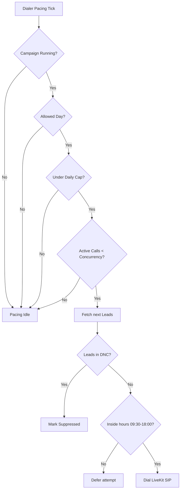

# Outbound Dialer Safety and Compliance Controls

Dana enforces strict compliance regulations to protect consumer privacy and guarantee TCPA alignment during outbound calling campaigns.

## Safety Constraints Enforced

1. **Do Not Call (DNC) Registry Scrubbing**
   - Leads are checked against the local `dnc_requests` table before dialing.
   - Any lead whose phone number exists in `dnc_requests` is marked as `suppressed` with reason `dnc`.
   - If an operator manually marks a call outcome as `dnc` or `wrong_number`, the number is immediately inserted into the DNC suppression database.

2. **Allowed Calling Windows**
   - Outbound calling defaults to **09:30 AM to 06:00 PM (18:00)** local time of the lead's state.
   - Calling hours are resolved by mapping states (e.g. TN, NY, CA) to their timezone (e.g. Eastern, Central, Pacific) using `ZoneInfo`.
   - If a lead falls outside this window, dialing is blocked.

3. **Allowed Calling Days**
   - Outbound calling is restricted to Mon-Fri (Monday to Friday) by default.
   - Calling on weekends is blocked unless explicitly enabled in the campaign configurations.

4. **Daily Calling Cap**
   - Campaigns enforce a maximum daily cap (default 100 calls).
   - Once `calls_started_today` matches or exceeds `daily_call_cap`, pacing halts.

5. **Concurrency Limits**
   - The queue respects `max_concurrent_calls` to limit active channels and prevent flood dialing.
   - Dialer pacing calculations will only fetch up to `max_concurrent_calls - active_calls` leads.

6. **Consent & compliance controls**
   - Calls require explicit consent before transferring to a licensed agent.
   - Dana will never state she is licensed, quote exact prices, promise approval, or claim "you qualify."

## Dialer safety check implementation in code

Below is the logical flowchart of checks executing on every dialer pacing tick:

## Local Testing Safeties

By default, the campaign dialer operates in dry-run/mock mode. In this mode, mock attempts are recorded in the database, but no live SIP trunk triggers occur, protecting developer sandboxes from accidental carrier bills or compliance violations.
To verify safety workflows locally, developers can test using:
`python scripts/run_outbound_dialer_once.py --campaign-id "CAMP_ID" --dry-run`
which will evaluate constraints and return logs of what would be dialed.
