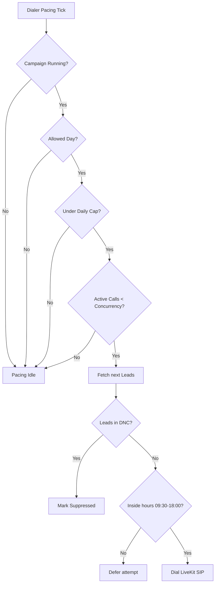

# Outbound Dialer Safety and Compliance Controls

Dana enforces strict compliance regulations to protect consumer privacy and guarantee TCPA alignment during outbound calling campaigns.

## Safety Constraints Enforced

1. **Do Not Call (DNC) Registry Scrubbing**
   - Leads are checked against the local `dnc_requests` table before dialing.
   - Any lead whose phone number exists in `dnc_requests` is marked as `suppressed` with reason `dnc`.
   - If an operator manually marks a call outcome as `dnc` or `wrong_number`, the number is immediately inserted into the DNC suppression database.

2. **Allowed Calling Windows**
   - Outbound calling defaults to **09:30 AM to 06:00 PM (18:00)** local time of the lead's state.
   - Calling hours are resolved by mapping states (e.g. TN, NY, CA) to their timezone (e.g. Eastern, Central, Pacific) using `ZoneInfo`.
   - If a lead falls outside this window, dialing is blocked.

3. **Allowed Calling Days**
   - Outbound calling is restricted to Mon-Fri (Monday to Friday) by default.
   - Calling on weekends is blocked unless explicitly enabled in the campaign configurations.

4. **Daily Calling Cap**
   - Campaigns enforce a maximum daily cap (default 100 calls).
   - Once `calls_started_today` matches or exceeds `daily_call_cap`, pacing halts.

5. **Concurrency Limits**
   - The queue respects `max_concurrent_calls` to limit active channels and prevent flood dialing.
   - Dialer pacing calculations will only fetch up to `max_concurrent_calls - active_calls` leads.

6. **Consent & compliance controls**
   - Calls require explicit consent before transferring to a licensed agent.
   - Dana will never state she is licensed, quote exact prices, promise approval, or claim "you qualify."

## Dialer safety check implementation in code

Below is the logical flowchart of checks executing on every dialer pacing tick:

## Live Mode Activation Safety

To guarantee that developers or operators do not accidentally trigger real calls, two layers of safety guards are implemented:

1. **Readiness Check Requirement**:
   Before any real outbound dial or single test call is executed, a full `LiveTelephonyReadinessChecker` check must pass. This audits environment variables, LiveKit SDK availability, provider config settings, and campaign status. If any critical checks fail, the call is blocked.

2. **Operator & Explicit Confirmation**:
   Any live call trigger (via CLI or Web UI) requires:
   - A valid Operator ID / Name.
   - An explicit confirmation phrase input of `"LIVE CALL"`. If this exact string is not provided, the trigger will fail.

These features ensure that all outbound dialing campaigns are triggered with deliberate intent.

---

## Caller ID Reputation & DID Pool Rotation Controls

In addition to lead and campaign-level safety boundaries, Dana monitors and paces caller ID usage at the individual number level:

1. **Per-Number Daily & Hourly Caps**
   - Each number in the DID pool is restricted by daily and hourly limits (default: 100/day, 20/hour) to prevent aggressive signaling that triggers carrier spam labeling.
   - If a number hits its daily or hourly cap, it is automatically skipped in the rotation until the boundary resets.

2. **Reputation Status Enforcement**
   - Paused, blocked, or retired numbers are permanently filtered from candidate selection.
   - Numbers with active cooldown markers (`cooldown_until`) are skipped until the cooldown time has passed.

3. **Spam Reputation & Health-Weighted Selection**
   - Candidate selection prioritizes numbers with the highest computed reputation score.
   - Numbers that are flagged by carriers or have high complaint/DNC outcomes receive a penalty, lowering their selection priority and automatically cooling them down.

4. **Cross-Provider Isolation**
   - Cross-provider rotation is blocked by default (e.g. BulkVS numbers cannot be used under Telnyx active provider trunks).
   - This ensures high attestation levels (A-level STIR/SHAKEN) and minimizes the risk of call labeling.
