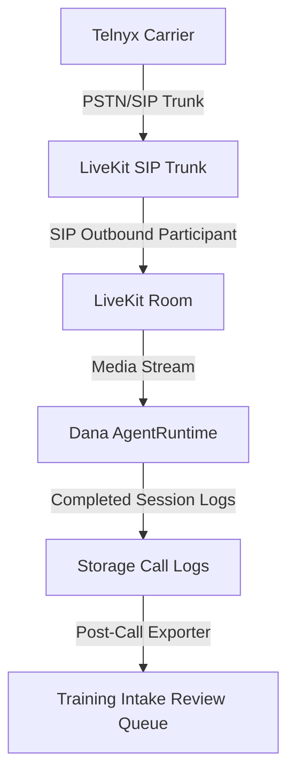
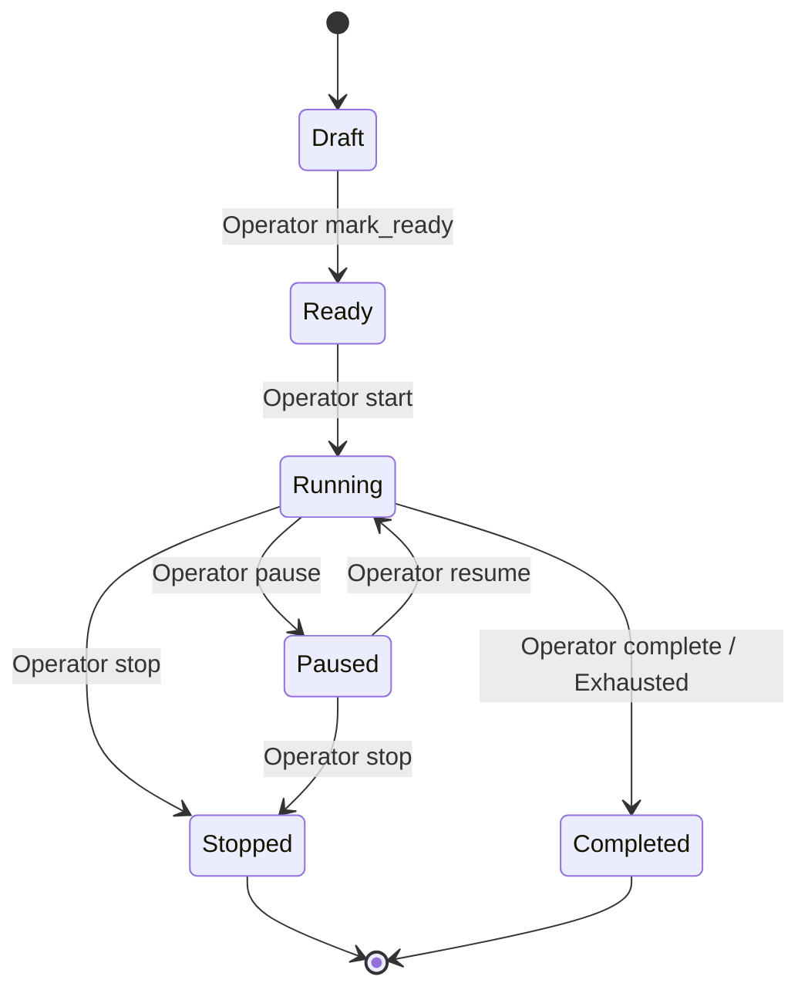

# Telephony Campaign Operations Center - User Runbook

This guide describes how to run and monitor outbound voicebot campaigns with Dana.

## Architecture



- **Telnyx**: Telephony carrier that hosts caller IDs and connects to LiveKit via SIP.
- **LiveKit**: WebRTC and SIP routing server which routes media to the Dana Voice Agent.
- **Dana AgentRuntime**: Processes human speech, checks safety boundaries, and responds.
- **Post-Call Exporter**: Automatically moves call logs into training data review folders for curation.

## Campaign Lifecycle

Outbound campaigns transition through these logical states:

1. **Draft**: Newly created, configurations can be modified, no dialing allowed.
2. **Ready**: Campaign is ready to run, configurations locked, waiting for operator start.
3. **Running**: Dialer pacing ticks are active. New attempts are scheduled.
4. **Paused**: Dialer pacing is temporarily suspended. Active calls finish.
5. **Stopped**: Dialing is terminated. Active calls are ended. Can be restarted.
6. **Completed**: All leads exhausted or daily caps hit. Can no longer restart.



## Lead Lifecycle

Leads imported into a campaign progress through the following states:

- `new`: Imported lead, not yet dialed.
- `queued`: Selected by dialer pacing queue and scheduled for next tick.
- `dialing`: Outbound call placed, waiting for answer.
- `in_call`: Lead answered, actively conversing with Dana.
- `completed`: Call completed, outcome recorded, or retry policy exhausted.
- `callback`: Call ended, scheduled to retry at a specific callback time.
- `dnc`: Lead requested Do Not Call (DNC). Removed from dialing permanently.
- `wrong_number`: Phone is wrong or invalid. Removed from dialing permanently.
- `failed`: Dialer attempt failed (concurrency limits, networking, or SIP reject).

## Pacing & Dialer Tick Workflow

Outbound campaigns pace call placement using a queue-ticking model:
1. Every tick, the system checks if the campaign is `running`.
2. Checks daily cap: `calls_started_today` < `daily_call_cap`.
3. Checks calling window: current local time is inside calling hours (default 09:30 - 18:00 local time).
4. Checks calling days: Mon-Fri only.
5. Checks current active concurrency: `active_calls` < `max_concurrent_calls`.
6. Resolves next eligible leads sorted by priority and retry schedules.
7. Places outbound calls using the LiveKit Outbound adapter.

## Live Call Monitor

Operators can track calls in real-time through the Web Console:
- View active SIP rooms, current compliance warnings, and running transcripts.
- **Hangup Control**: Operators can force hang up a call session instantly.
- **Outcome Override**: Manual override of outcomes if needed (e.g. sale, wrong_number).
- **Training Export**: Instantly export call transcript turns to the training intake orchestrator.

## Command Line Controls

Manage campaign resources directly from the CLI:

### Provider Config Management
```bash
# Create provider configuration
python scripts/manage_telephony_campaigns.py provider create --name "LiveKit Prod Trunk" --livekit-url "wss://livekit.cloud" --livekit-outbound-trunk "tr_123"

# List provider configurations
python scripts/manage_telephony_campaigns.py provider list
```

### Campaign Controls
```bash
# Create campaign
python scripts/manage_telephony_campaigns.py campaign create --name "FE Outbound June" --caller-id "+15550100" --transfer-phone "+18005550199"

# Start campaign (operator name is required)
python scripts/manage_telephony_campaigns.py campaign start --campaign-id "CAMP_ID" --operator "Jimmy"

# Pause campaign
python scripts/manage_telephony_campaigns.py campaign pause --campaign-id "CAMP_ID" --operator "Jimmy" --reason "Lunch break"

# Stop campaign
python scripts/manage_telephony_campaigns.py campaign stop --campaign-id "CAMP_ID" --operator "Jimmy" --reason "Shift finished"
```

### Lead Importing
```bash
# Import CSV or JSON leads
python scripts/import_campaign_leads.py --campaign-id "CAMP_ID" --file "data/leads/june_leads.csv"
```

### Dialer Queue Ticks
```bash
# Dry run dialer tick
python scripts/run_outbound_dialer_once.py --campaign-id "CAMP_ID" --dry-run

# Mock dialer tick (write attempts but do not call LiveKit APIs)
python scripts/run_outbound_dialer_once.py --campaign-id "CAMP_ID" --no-dry-run

# Live dialer tick (places actual calls)
python scripts/run_outbound_dialer_once.py --campaign-id "CAMP_ID" --no-dry-run --live-mode

---

## Caller ID DID Pool & Reputation Management

To optimize campaign delivery and track carrier reputation, Dana includes a Caller ID DID Pool management interface directly in the Telephony dashboard and backend console.

### Compliant DID Pool Rotation
Instead of relying on static environment fallbacks or single outbound caller IDs, the outbound dialer queries the DID pool to dynamically select a phone number for each dialing attempt. 

The pool selection logic supports the following rotation strategies:
- `health_weighted` (Default): Selects the number with the highest computed reputation score. Numbers with spam labels (`suspected`, `flagged`, `blocked`), complaints, or low answer/transfer rates are heavily penalized.
- `round_robin`: Rotates caller IDs based on the date/time they were last used, ensuring even distribution across the entire active pool.
- `least_used`: Rotates numbers based on total calls placed today to spread call volume evenly.

### Per-Number Call Caps & Cooldowns
To remain compliant and avoid getting flagged as spam, every caller ID enforces safety caps:
- **Daily Cap**: The maximum number of calls placed by a single number in a day (default: 100).
- **Hourly Cap**: The maximum number of calls placed by a single number in an hour (default: 20).
- **Cooldown**: If a number gets a high bounce rate or is manually placed in cooldown (`cooldown_until`), it is excluded from selection until the cooldown period ends.
```

### Telnyx DID Inventory Sync
Deployments should configure automation to sync Telnyx numbers periodically. 
For more details, see [Telnyx DID Inventory Sync](file:///C:/Users/jimbo/.gemini/antigravity/worktrees/ultimate-voice/telephony-campaign-ops-layer/docs/telnyx_did_inventory_sync.md).
